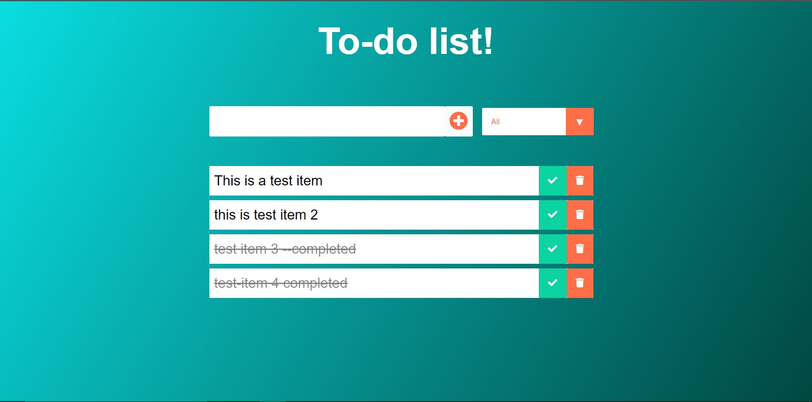

<h1> To-Do App </h1>

A simple React App that allows you to keep track of your tasks. You can add tasks, delete 
them or mark them completed. The app allows you to view completed and incomplete tasks by 
filtering out the tasks. 

Screenshots :

<ul >
  <li>
    
 Two tasks are marked as completed (hence the strikethrough ). One task is scheduled to be deleted. Rest are incomplete.  

     
    
  </li>
  <li>
     
    
One task has been deleted  

    
    
  </li>
  <li>
   
  
 Using filter to see completed tasks only  

   
  
  </li>
  <li>
   
  
 Using filter to see incomplete tasks only  

   
  
  </li>
    </ul>
    
  
 
  

